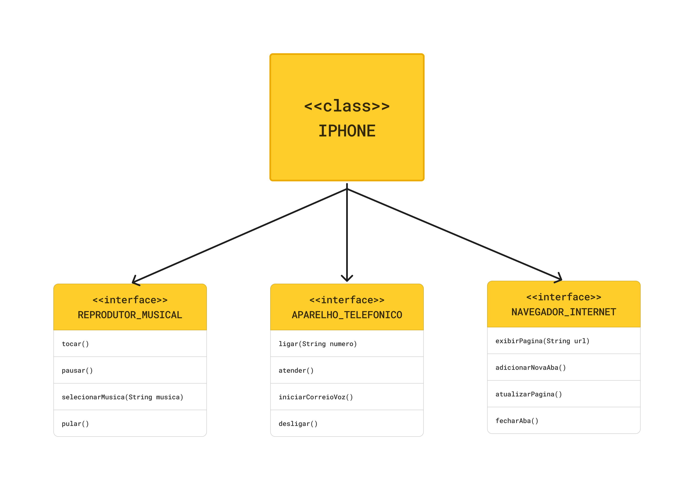

# DIO - Projeto - Modelagem e Diagramação de um Componente iPhone

`Projeto realizado para práticar o que foi aprendido no módulo de Orientação a Objetos`

[Repositório do Projeto](https://github.com/digitalinnovationone/trilha-java-basico/tree/main/desafios/poo)

## Desafio
- [X] Faça a modelagem e diagramação UML do componente Iphone
- [X] Implementar as interfaces
- [X] Implementar as classes

## Arquivos
- `Main.java`: a parte que instancia a classe Iphone com as funcionalidades do aparelho.
- `Iphone.java`: classe Iphone e implementando os métodos de Aparelho Telefonico, Navegador e Reprodutor Musical.
- `Interfaces (ReprodutorMusical, NavegadorInternet, AparelhoTelefonico)`: interfaces 

;